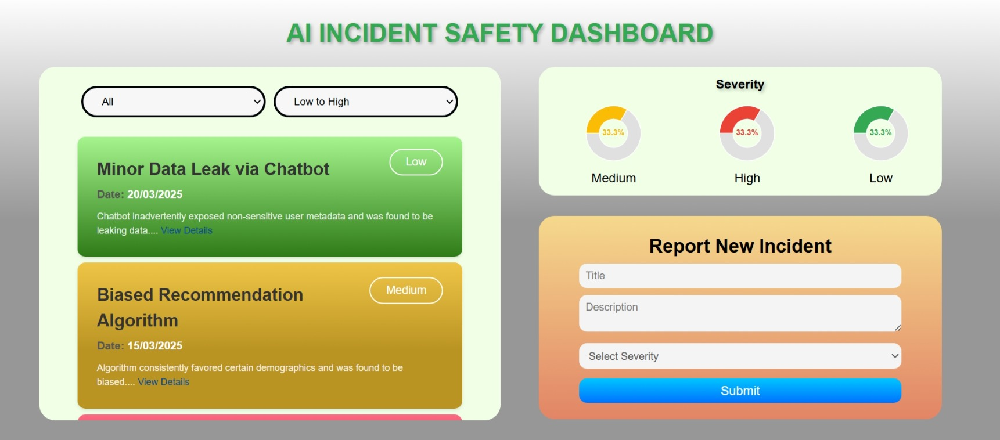

# AI Safety Incident Dashboard

This project is a **React + Vite** web application that displays and tracks AI Safety incidents like biased recommendations, hallucinated critical info, and minor data leaks.



## Project Information

- **Framework Used**: React 19
- **Bundler**: Vite 6.3
- **For displaying Charts**: Recharts
- **For conformation Notification of submitted new Incident**: React Toastify


## Steps to install from github and run locally

1. **Clone the repository**:

   ```bash
   git clone https://github.com/sonu12221719/AI-Safety-Incident-Dashboard.git
   cd AI-Safety-Incident-Dashboard
   ```
   
2. **Install dependencies**:

   ```bash
   npm install
   ```

3. **Run the development server**:

   ```bash
   npm run dev
   ```

4. **Build for production**:

   ```bash
   npm run build
   ```

**Hosted link of this project**:
[https://sonu12221719.github.io/AI-Safety-Incident-Dashboard/](https://sonu12221719.github.io/AI-Safety-Incident-Dashboard/)

**Figma Link**:
https://www.figma.com/design/tgC5j52NSpgghFcKrnt3KL/AI-incident-safety-dashboard?node-id=0-1&p=f&t=A0mTXU0s15Lmc9aj-0

## Project Structure

```
src/
  ├── components/
      ├── Filters.jsx
      ├── IncidentList.jsx
      ├── ReportForm.jsx
      ├── SeverityChart.jsx
  ├── App.css
  ├── App.jsx
  ├── index.css
  ├── main.jsx
public/
  ├── favicon.ico
index.html
vite.config.js
package.json
```
